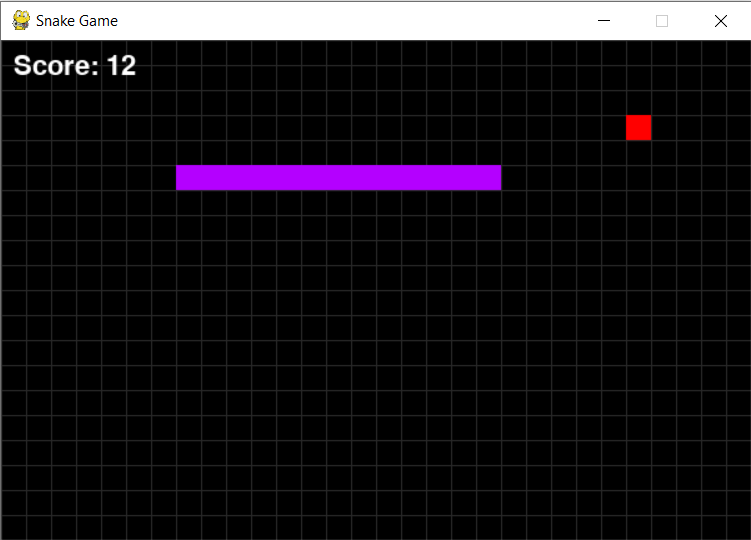

# 🐍 Snake Game (Python + Pygame)

A customizable Snake game built using Python and Pygame.

## 🎮 Gameplay Preview




## ✨ Features
- Interactive start menu
- Select background music before playing
- Choose different snake skins
- Classic grid-based Snake gameplay
- Increasing difficulty as score increases
- Persistent high score stored locally
- Restart game or return to menu after game over

## 🎮 Controls

### Menu
- **P / Enter** – Play
- **1 / 2 / 3** – Choose background music
- **S** – Change snake skin

### Game
- **Arrow Keys** – Move the snake

### Game Over
- **R** – Restart with same settings
- **M** – Return to main menu
- **Q** – Quit

## 🛠 Tech Stack
- Python
- Pygame

## ▶️ How to Run

```bash
pip install -r requirements.txt
python snake.py
